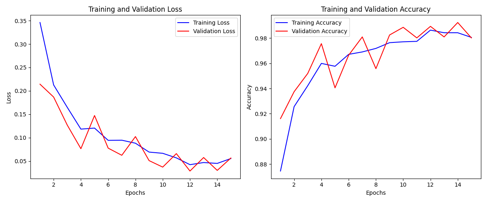
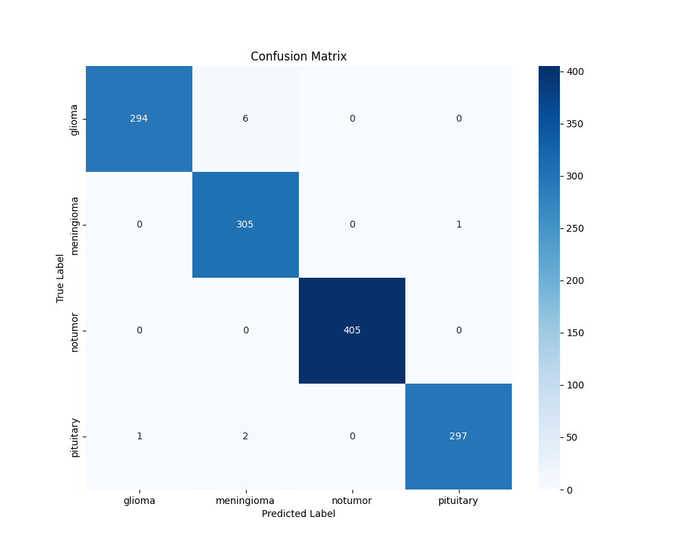

# Brain Tumor MRI Classification

## Project Overview
This repository contains a deep learning model for automatic classification of brain tumors from MRI scans. The model uses a fine-tuned ResNet-50 architecture to classify brain MRIs into four categories: glioma, meningioma, no tumor, and pituitary tumor.


## Key Features
- Utilizes transfer learning with pre-trained ResNet-50 architecture
- Achieves high accuracy in classifying four different brain conditions
- Implements data augmentation techniques to improve model generalization
- Includes comprehensive evaluation metrics and visualizations

## Dataset
The model is trained on a dataset of brain MRI scans organized into four classes:
- Glioma tumor
- Meningioma tumor
- No tumor
- Pituitary tumor

You can find it here:
https://www.kaggle.com/datasets/arifmia/brain-tumor-update-dataset

The dataset is structured as follows:
```
archive/
├── Training/
│   ├── glioma/
│   ├── meningioma/
│   ├── notumor/
│   └── pituitary/
└── Testing/
    ├── glioma/
    ├── meningioma/
    ├── notumor/
    └── pituitary/
```

## Model Architecture
- Base model: ResNet-50 (pre-trained on ImageNet)
- Customizations:
  - Frozen early layers to preserve learned features
  - Added dropout (0.5) to reduce overfitting
  - Modified final fully connected layer for 4-class classification

## Training Process
- **Optimizer**: Adam with learning rate of 0.001
- **Learning Rate Scheduler**: ReduceLROnPlateau for adaptive learning rate
- **Data Augmentation**: Random horizontal flips, rotations, and color jitter
- **Training Duration**: 15 epochs
- **Early Stopping**: Model checkpoint saved on best validation accuracy

## Results

### Training and Validation History

*Training and validation loss/accuracy over epochs*

### Confusion Matrix

*Confusion matrix showing model performance across all classes*

### Performance Metrics
| Class | Precision | Recall | F1-Score |
|-------|-----------|--------|----------|
| glioma | 0.9966 | 0.9800 | 0.9882 |
| meningioma | 0.9744 | 0.9967 | 0.9855 |
| notumor | 1.0000 | 1.0000 | 1.0000 |
| pituitary | 0.9966 | 0.9900 | 0.9933 |

**Overall Test Accuracy**: 99.24%

## Requirements
```
torch>=1.7.0
torchvision>=0.8.0
numpy>=1.19.0
matplotlib>=3.3.0
scikit-learn>=0.23.0
seaborn>=0.11.0
Pillow>=8.0.0
```

## Usage

### Installation
```bash
git clone https://github.com/yourusername/brain-tumor-classification.git
cd brain-tumor-classification
pip install -r requirements.txt
```

### Training
```bash
python train.py
```

### Inference
```python
import torch
from torchvision import transforms
from PIL import Image
from model import create_model

# Load model
checkpoint = torch.load('tumor_classifier_model.pth')
model = create_model()
model.load_state_dict(checkpoint['model_state_dict'])
model.eval()

# Prepare image
transform = transforms.Compose([
    transforms.Resize((224, 224)),
    transforms.ToTensor(),
    transforms.Normalize([0.485, 0.456, 0.406], [0.229, 0.224, 0.225])
])
image = Image.open('path_to_your_image.jpg').convert('RGB')
image = transform(image).unsqueeze(0)

# Predict
with torch.no_grad():
    outputs = model(image)
    _, predicted = torch.max(outputs, 1)
    
print(f"Predicted class: {checkpoint['classes'][predicted.item()]}")
```

## License
MIT

## Acknowledgements
- [PyTorch](https://pytorch.org/)
- [torchvision](https://pytorch.org/vision/stable/index.html)
- [scikit-learn](https://scikit-learn.org/)
